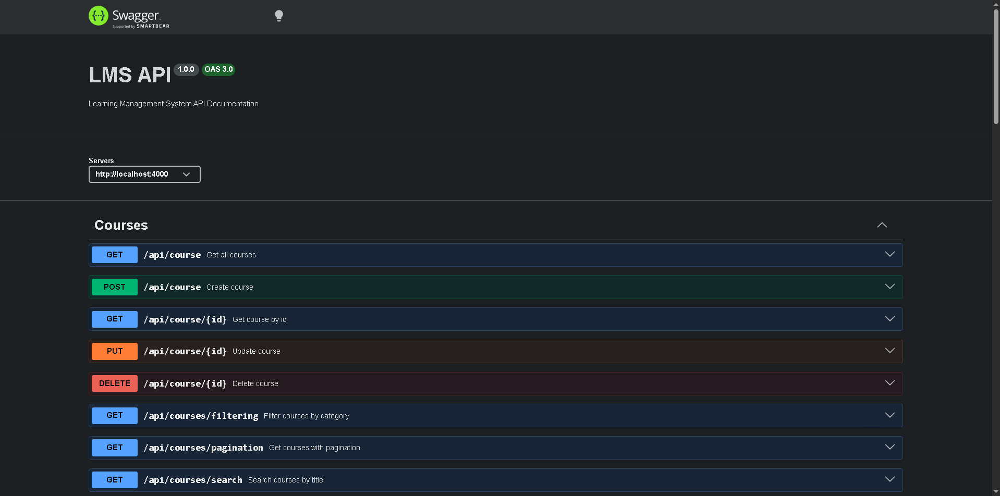

# Learning Management System (LMS)

## 📌 About
A RESTful API for a Learning Management System built with Node.js, Express.js, and MongoDB.

## 🚀 Features
- Authentication & Authorization (JWT)
- Course Management
- Categories
- Lessons
- Enrollments
- Quiz & Results
- Reviews
- Wishlist
- Search, Filter & Sorting
- Swagger API Documentation

## 🛠️ Technologies
- Node.js
- Express.js
- MongoDB
- Mongoose
- JWT
- Multer
- Swagger

## 📷 API Documentation



## ⚙️ Installation

```bash
npm install
npm start
```

## 📄 API Documentation

Open:

http://localhost:4000/api-docs
